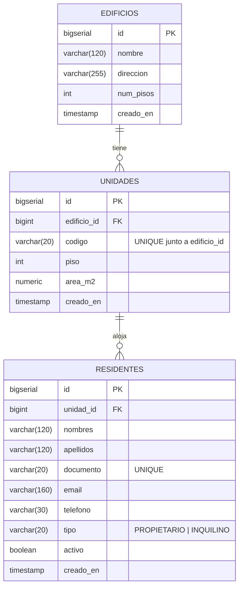

# Diagrama Entidad-Relacion — ms-residentes

Base: **PostgreSQL** · `condominio_residentes`

## Relaciones

| Desde | Hacia | Cardinalidad | Clave foranea |
|-------|-------|--------------|---------------|
| `edificios` | `unidades` | 1 a N | `unidades.edificio_id` |
| `unidades` | `residentes` | 1 a N | `residentes.unidad_id` |

La relacion **`unidades` ← `residentes`** es la que cumple el requisito del
curso de tener al menos dos tablas relacionadas por base SQL.

## Restricciones

- `unidades`: `UNIQUE (edificio_id, codigo)` — no puede haber dos "A-101" en el
  mismo edificio, pero si en edificios distintos.
- `residentes`: `UNIQUE (documento)` — una persona aparece una sola vez.
- `residentes.tipo`: `CHECK` limitado a `PROPIETARIO` o `INQUILINO`.
- Indices en `unidades.edificio_id` y `residentes.unidad_id`, que son las
  columnas por las que mas se filtra.

## Frontera con los otros microservicios

Las **cuentas de acceso** no estan aca: viven en `ms-usuarios`, en su propia
base. Alla, `usuarios.residente_id` guarda el id de esta tabla `residentes`
como **identificador logico**, sin clave foranea: son bases distintas y
PostgreSQL no puede verificar una referencia que esta fuera de su alcance.

Lo mismo hacen `ms-pagos` (`cuotas.unidad_id`) y `ms-incidencias`
(`incidencias.unidad_id`). Ese es el precio de que cada microservicio sea
autonomo, y la razon por la que el cruce entre bases se resuelve con Athena.

El DDL completo esta en [schema.sql](schema.sql).
